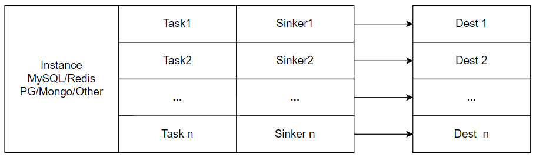

# datagos
a data sync tool to replace canal like tools.

## structure

## Planned features

### supported datasource
1. mysql
2. postgresql
3. mongodb
4. redis

### supported sinkers
1. mysql
2. postgresql
3. mongodb
4. redis
5. kafka
6. rocketmq

### Monitoring

default monitoring is supported by prometheus

### data verification

### task management

### mappings and filters

## Benchmarks.

